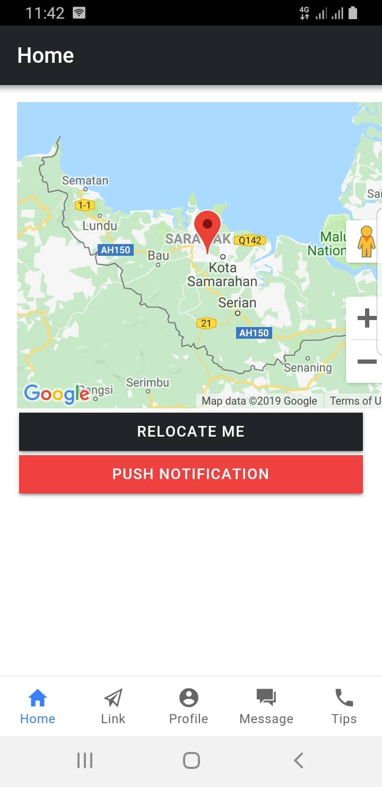
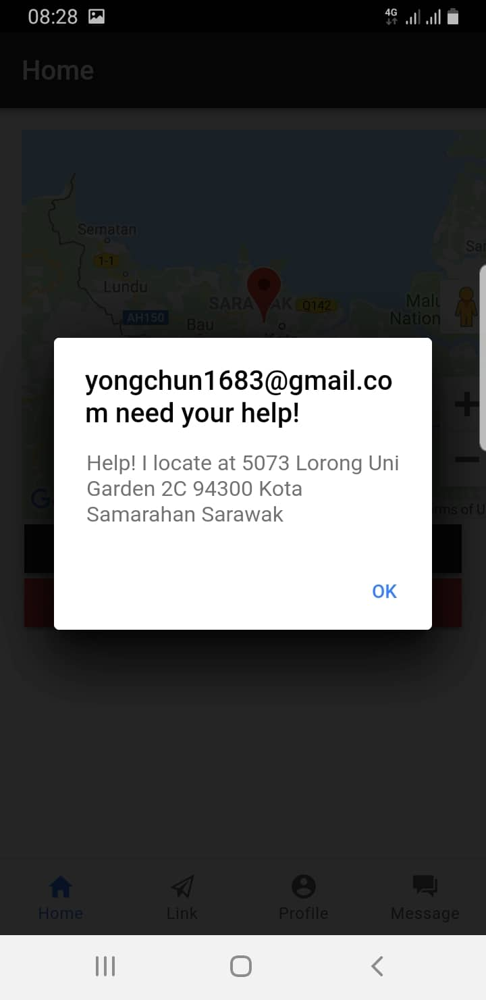
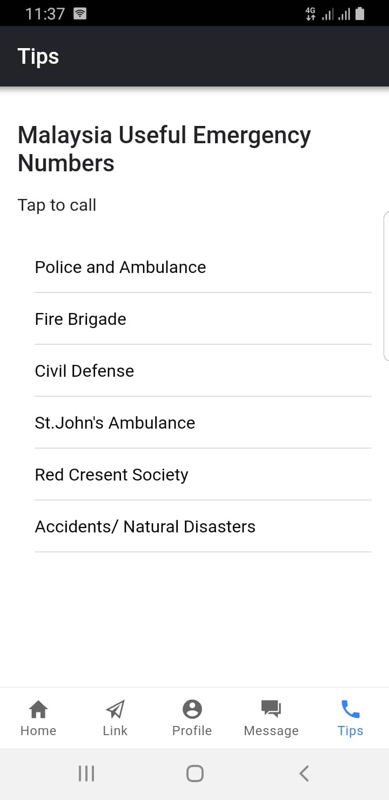

# Emergency Notification Mobile App

A hybrid app that can used to send an emergency notification to the user's linked family members or friend.

This app is build with hybrid app framework called Ionic, it can support multiple platform by only using a single code base.

The notification is handle by Google Firebase Cloud Messaging, and the notification is device-to-device and also device-to-browser.

## Stack

**Front-end**

Ionic 4.0, Angular 7, and Google Maps API

**Back-end**

Google Firebase, Cloud Firestore, and Firebase Cloud Messaging

**Installation**
    
- clone this repository
- register application in Firebase
- register a JavaScript Google Maps API key
- filled the required keys in the following files
    - firebase-messaging-sw.js
    - environment.ts
    - index.html
    - google-services.json
- install node in your device
- install dependecies
    ```
        npm install
    ```
- install ionic
    ```
        npm install ionic
    ```
- install cordova
    ```
        npm install cordova
    ```    
- execute in browser
    ```
        ionic serve
    ```
- execute in android
    ```
        ionic cordova build android
        ionic cordova run android
    ```

**Interfaces**






    